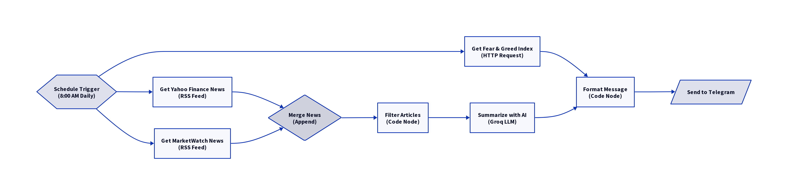

# MarketPulse

**AI-Powered Daily Market Intelligence for Value Investors - Built with n8n**

<div align="center">
  

  [](https://github.com/creator35lwb-web/MarketPulse)
  [](https://github.com/creator35lwb-web/MarketPulse)
  [](LICENSE)
  [](https://n8n.io)
</div>

---

## 🌟 What is MarketPulse?

MarketPulse is an open-source n8n workflow that delivers comprehensive daily market briefings for value investors. It aggregates real-time economic data from the Federal Reserve (FRED), market sentiment from CNN Fear & Greed Index, financial news headlines, and stock watchlist prices into a single actionable digest delivered via Telegram.

This project embodies the **"Bootstrapper's Edge"** philosophy: leveraging developer incentives and open-source tools to build persistent, high-value intelligence systems at minimal cost.

---

## 📢 Latest Update: v5.0 - Production Ready (FRED Integration)

**Release Date:** January 21, 2026

### What's New in v5.0

| Feature | Description |
|---------|-------------|
| **FRED API Integration** | Real-time economic data from Federal Reserve (monthly/quarterly) |
| **New Indicators** | Fed Funds Rate + 10-Year Treasury Yield added |
| **Reliable Architecture** | Single Code node fetches all data sequentially (no more race conditions) |
| **Clean Output** | No Markdown symbols - pure plain text formatting |
| **Stock % Change** | Calculated from previous close (reliable calculation) |
| **Emoji Indicators** | Fear & Greed score shown with color-coded emojis |

### Data Sources

| Data | Source | Frequency |
|------|--------|-----------|
| Fear & Greed Index | CNN DataViz API | Daily |
| GDP Growth | FRED (A191RL1Q225SBEA) | Quarterly |
| Inflation/CPI | FRED (CPIAUCSL) | Monthly |
| Unemployment | FRED (UNRATE) | Monthly |
| Fed Funds Rate | FRED (DFEDTARU) | Daily |
| 10Y Treasury | FRED (DGS10) | Daily |
| Headlines | MarketWatch RSS | Real-time |
| Stock Prices | Yahoo Finance | Real-time |

### Validation Status

| Component | Status | Notes |
|-----------|--------|-------|
| CNN Fear & Greed | ✅ Working | Score with daily/weekly change |
| FRED Economic Data | ✅ Working | All 5 indicators fetching |
| MarketWatch RSS | ✅ Working | 8+ headlines with entity decoding |
| Google Gemini LLM | ✅ Working | Plain text output (no Markdown) |
| Yahoo Finance | ✅ Working | 5 stocks with % change |
| Telegram Bot | ✅ Validated | Clean formatted messages |

---

## 💡 Why MarketPulse?

Professional traders have Bloomberg terminals. Retail investors have information overload. MarketPulse levels the playing field.

### The Problem

-   **Information Overload:** It's impossible to keep up with the constant stream of financial news.
-   **Lack of Context:** News headlines alone don't capture market sentiment.
-   **Costly Tools:** Professional analysis tools are prohibitively expensive for individual investors.
-   **Time Consuming:** Manually gathering and analyzing news takes hours every day.

### The Solution

MarketPulse provides a fully automated workflow that:

1.  **Aggregates News:** Pulls data from multiple financial news RSS feeds (MarketWatch).
2.  **Analyzes Sentiment:** Uses a free-tier Large Language Model (Groq) to analyze headlines and provide a sentiment score (Bullish, Bearish, Neutral).
3.  **Gathers Key Metrics:** Fetches the Fear & Greed Index for a broader market context.
4.  **Delivers a Digest:** Sends a clean, easy-to-read summary to your Telegram channel every morning.

---

## 🏗️ Architecture: The n8n Workflow

MarketPulse is a single, powerful n8n workflow running on n8n Cloud. The architecture is designed for efficiency and resilience.

<p align="center">
  
</p>

### Key Components (v2.2)

1.  **Schedule Trigger:** Runs the workflow every weekday morning at 7 AM.
2.  **Data Collection:** HTTP Request nodes gather data from Alternative.me (Fear & Greed) and MarketWatch RSS.
3.  **RSS Parser:** Code node parses MarketWatch XML format and extracts headlines.
4.  **Input Validation:** Sanitizes and validates all incoming data.
5.  **AI Processing:** Groq LLM (Llama-3) analyzes headlines and determines sentiment.
6.  **Merge Node:** Synchronizes both data streams before composing the message.
7.  **Message Composer:** Formats the data into a clean digest with required disclaimers.
8.  **Telegram Delivery:** Sends the final digest to your configured channel.
9.  **Error Handler:** Sanitized error alerts (no credential leakage).

---

## 🔑 Required API Keys

| Service | Purpose | Free Tier | Get It |
|---------|---------|-----------|--------|
| **FRED** | Economic Data | Unlimited (free) | [fred.stlouisfed.org](https://fred.stlouisfed.org/docs/api/api_key.html) |
| **Google Gemini** | LLM Sentiment Analysis | Free tier available | [ai.google.dev](https://ai.google.dev/) |
| **Telegram Bot** | Message Delivery | Unlimited | [@BotFather](https://t.me/BotFather) |
| **CNN Fear & Greed** | Market Sentiment | No key required | Built-in |
| **MarketWatch RSS** | Financial News | No key required | Built-in |
| **Yahoo Finance** | Stock Prices | No key required | Built-in |

---

## 🛡️ Security and Ethics: The VerifiMind-PEAS Guarantee

MarketPulse has been validated by the **[VerifiMind-PEAS](https://github.com/creator35lwb-web/VerifiMind-PEAS) X-Z-CS RefleXion Trinity**, ensuring it is innovative, ethical, and secure.

| Agent | Role | Validation |
|-------|------|------------|
| **X-Agent (Innovation)** | Strategic Novelty | Validated the clever synthesis of free infrastructure and AI for democratizing financial intelligence. |
| **Z-Agent (Ethics)** | Ethical Alignment | Ensured the design includes clear disclaimers that this is **not financial advice**. |
| **CS-Agent (Security)** | Security Posture | Confirmed that risks are manageable with mandatory authentication and secure credential management. |

📖 **[Read the Full VerifiMind-PEAS Case Study →](docs/CASE_STUDY_VERIFIMIND_PEAS.md)**

This case study demonstrates how the VerifiMind-PEAS methodology was applied to validate MarketPulse from concept to production, showcasing the framework's practical application in real-world AI development.

---

## 🚀 Getting Started

This project is designed to be easily replicated. The full implementation guide, including how to set up your free cloud infrastructure, is in the [ARCHITECTURE.md](docs/ARCHITECTURE.md) file.

### Quick Start

1. **Import Workflow:** Import `MarketPulse-Secure/workflows/marketpulse-workflow-v5.0.json` into your n8n instance
2. **Add FRED API Key:** Edit the "Fetch All Market Data" node and replace `YOUR_FRED_API_KEY_HERE` on line 8
3. **Configure Credentials:** Add your Google Gemini API key and Telegram Bot Token in n8n credentials
4. **Set Channel ID:** Update the Telegram nodes with your channel ID
5. **Activate:** Publish the workflow to enable the daily 7AM schedule

### The Workflow Files

| File | Description |
|------|-------------|
| `MarketPulse-Secure/workflows/marketpulse-workflow-v5.0.json` | **Latest production version** (recommended) |
| `MarketPulse-Secure/workflows/marketpulse-workflow-v4.1-fixed.json` | Previous stable version |
| `workflows/MarketPulse.json` | Original v1.0 workflow |

### Example Daily Digest

```
📊 MarketPulse Daily Digest
━━━━━━━━━━━━━━━━━━━━
📅 Tuesday, January 21, 2026

🎯 FEAR & GREED INDEX 🟡
Score: 48/100 | Neutral
Change: -14 (1d) | -11 (1w)

📈 ECONOMIC INDICATORS (USA)
• GDP Growth (Jul 2025): +4.3% (QoQ)
• Inflation/CPI (Dec 2025): 2.65%
• Unemployment (Dec 2025): 4.1%
• Fed Funds Rate: 4.50%
• 10Y Treasury: 4.62%

📊 WATCHLIST
• GOOGL: $195.27 (+0.85%)
• BABA: $85.12 (-1.23%)
• ADBE: $452.30 (+0.42%)
• SOFI: $14.56 (-2.15%)
• ASML: $698.45 (+1.78%)

💡 AI ANALYSIS
MARKET SENTIMENT: Neutral
Confidence: Medium

KEY THEMES:
- Mixed economic signals with strong GDP but elevated rates
- Technology sector showing resilience amid market uncertainty

SUMMARY:
Markets are consolidating as investors digest mixed economic data.
The Fed's pause on rate cuts continues to weigh on valuations
while corporate earnings remain stable.

━━━━━━━━━━━━━━━━━━━━
⚠️ Disclaimer: AI-generated analysis for informational purposes only.
Not financial advice.

📎 Sources: CNN Fear & Greed, FRED (Federal Reserve), MarketWatch, Yahoo Finance

MarketPulse v5.0 | Manus AI & Claude Code
```

---

## 📊 Version History

| Version | Date | Changes |
|---------|------|---------|
| v5.0 | Jan 21, 2026 | FRED API integration, Fed Rate & Treasury, reliable architecture |
| v4.1 | Jan 19, 2026 | Bug fixes, watchlist improvements |
| v4.0 | Jan 19, 2026 | Dynamic watchlist, dated economic data |
| v3.0 | Jan 18, 2026 | Valu-Analyst integration, Yahoo Finance stocks |
| v2.2 | Jan 19, 2026 | Fixed race condition, updated RSS feeds |
| v2.1 | Jan 18, 2026 | Security hardening, error handling |
| v2.0 | Jan 17, 2026 | Secure edition with VerifiMind-PEAS validation |
| v1.0 | Jan 06, 2026 | Initial release |

---

## 🤝 Contributing

MarketPulse is an open-source project, and we welcome contributions from the community. Please read our [CONTRIBUTING.md](CONTRIBUTING.md) to learn how you can get involved.

---

## 📜 License

MarketPulse is licensed under the **MIT License**.
