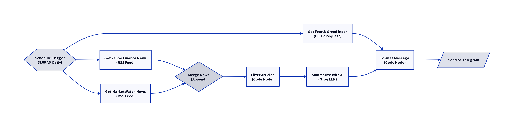

# MarketPulse

**Verified AI Market Intelligence for Value Investors — built with n8n**

> *A daily market digest that structurally cannot state a number that isn't in the data — and publicly scores its own past calls.*

<div align="center">
  

  [](https://creator35lwb-web.github.io/MarketPulse/)
  [](https://creator35lwb-web.github.io/MarketPulse/)
  [](LICENSE)
  [](https://n8n.io)

  [](https://t.me/n8nMarketPulse)
</div>

---

## 📢 Live Demo - Join Our Telegram Channel!

**See MarketPulse in action!** Join our public Telegram channel to receive daily market intelligence:

<div align="center">

  ### [👉 Join @n8nMarketPulse on Telegram](https://t.me/n8nMarketPulse)

</div>

Get daily briefings at 7 AM with Fear & Greed Index, economic indicators, stock watchlist, and AI-powered market analysis.

> **Support the Project:** If you find MarketPulse valuable, you can support us via Telegram's gift feature in the channel!

---

## 🌟 What is MarketPulse?

MarketPulse is an open-source n8n workflow that delivers a comprehensive daily market briefing for value investors — **US and China editions** — before the market opens. It aggregates real-time data (FRED economic indicators, CNN Fear & Greed, Yahoo Finance prices, financial-news headlines) and hands it to an AI analyst for interpretation.

**What makes it different is the verification.** Most AI market tools ask you to trust the model. MarketPulse is built so it *structurally cannot* state a number that isn't in the fetched data: every figure is computed in code, every AI claim must cite the exact data point it is based on, and any claim that can't be traced is withheld. The analysis is **attributed to the model that produced it**, and the system **publicly scores its own past calls** — hits and misses in the open, retrospective only, never a forward prediction.

It embodies the **"Bootstrapper's Edge"**: free infrastructure and open-source tooling building a persistent, high-trust intelligence system at near-zero cost.

> **🔗 Live dashboard:** https://creator35lwb-web.github.io/MarketPulse/ &nbsp;·&nbsp; **📢 Telegram:** [@n8nMarketPulse](https://t.me/n8nMarketPulse)

---

## 🔍 How the Verification Works

This is the core of the project — the part that separates it from a model that simply talks about the market:

1. **Code computes, the model only narrates.** Every number in the digest is fetched and calculated in code. The AI is never the source of a figure.
2. **Structured generation + an enforce gate.** The model must return a strict JSON structure where every claim cites a `factKey` that exists in the fetched data. A deterministic check cross-verifies each citation — an invented number, a citation to missing data, or a digit in the prose all fail the gate, and the offending claim is **withheld** rather than published.
3. **Dual-model with attribution.** The primary analyst is **Google Gemini 3.5 Flash**; if it is unavailable, a **Groq (Llama-3.3-70B)** fallback runs under the *identical* verification contract. Every analysis is stamped with the model that produced it — so accuracy can be measured per model.
4. **A public, self-scoring track record.** Each day's sentiment call is stored in a ledger and, once the market has actually traded, scored against what happened — hit or miss, in the open. It is strictly retrospective (no forward predictions), and it is reset rather than massaged if a measurement is ever found to be wrong.
5. **Existence-verified headline citations.** When the analysis references a news headline, that headline is checked to have genuinely appeared in the day's fetch — disclosed as existence-checked, not fact-checked.

## 📋 What's Inside Each Digest

**US edition** — a Value Investor Dashboard (Buffett Indicator / Market-Cap-to-GDP, Shiller CAPE, 10Y-2Y yield curve with inversion warning, S&P 500 vs its 200-day MA with Golden/Death-Cross signal), a market screener (S&P 500, Dow, VIX, Gold, Oil/WTI, US Dollar/DXY, Bitcoin), FRED economic indicators (GDP, CPI, unemployment, Fed funds, 10Y & 2Y Treasuries), a stock watchlist, the CNN Fear & Greed Index, and the verified AI analysis.

**China edition** — CSI 300, SSE Composite, SZSE Component and Hang Seng indices; a China watchlist (Moutai, CATL, BYD, Alibaba HK, Tencent HK); World Bank economic data; USD/CNY; China-market news headlines; and the same verified analysis layer.

Both editions carry the **track-record accuracy** line and a **verified-claims footer** disclosing how many claims were attributed to source data.

### Data Sources

| Data | Source | Frequency |
|------|--------|----------|
| Fear & Greed Index | CNN DataViz API | Daily |
| S&P 500 (^GSPC) | Yahoo Finance | Real-time |
| Dow Jones (^DJI) | Yahoo Finance | Real-time |
| VIX Volatility (^VIX) | Yahoo Finance | Real-time |
| Gold Futures (GC=F) | Yahoo Finance | Real-time |
| Oil/WTI (CL=F) | Yahoo Finance | Real-time |
| US Dollar/DXY (DX-Y.NYB) | Yahoo Finance | Real-time |
| Bitcoin (BTC-USD) | Yahoo Finance | Real-time |
| Wilshire 5000 (^W5000) | Yahoo Finance | Real-time |
| Shiller PE (CAPE) | multpl.com | Daily |
| GDP Growth | FRED (A191RL1Q225SBEA) | Quarterly |
| Nominal GDP | FRED (GDP) | Quarterly |
| Inflation/CPI | FRED (CPIAUCSL) | Monthly |
| Unemployment | FRED (UNRATE) | Monthly |
| Fed Funds Rate | FRED (DFEDTARU) | Daily |
| 10Y Treasury | FRED (DGS10) | Daily |
| 2Y Treasury | FRED (DGS2) | Daily |
| Headlines | MarketWatch RSS | Real-time |
| Stock Prices | Yahoo Finance | Real-time |

### Validation Status

| Component | Status | Notes |
|-----------|--------|-------|
| **Value Investor Dashboard** | ✅ Working | 4 indicators with color-coded emojis |
| Buffett Indicator | ✅ Working | Wilshire 5000 / GDP ratio with benchmarks |
| Shiller PE (CAPE) | ✅ Working | Scraped from multpl.com with valuation zones |
| Yield Curve (10Y-2Y) | ✅ Working | FRED DGS10 - DGS2 with inversion warning |
| S&P 500 vs 200D-MA | ✅ Working | Golden/Death Cross detection |
| CNN Fear & Greed | ✅ Working | Score with daily/weekly change |
| Market Screener (7 instruments) | ✅ Working | S&P 500, Dow, VIX, Gold, Oil, DXY, Bitcoin |
| FRED Economic Data | ✅ Working | All 7 indicators fetching (incl. 2Y Treasury) |
| MarketWatch RSS | ✅ Working | 8+ headlines with entity decoding |
| AI Analyst (dual-model) | ✅ Working | Gemini 3.5 Flash primary + Groq (Llama-3.3-70B) fallback, with model attribution |
| Verification / enforce gate | ✅ Working | Every AI claim cites fetched data or is withheld |
| Self-scoring track record | ✅ Working | Retrospective, published to the live dashboard |
| Yahoo Finance | ✅ Working | 3 stocks (GOOGL, BABA, ADBE) with % change |
| IPv4 DNS Fix | ✅ Working | Workflow-level fix, no system-wide impact |
| Retry Logic | ✅ Working | 3 attempts with exponential backoff |
| Telegram Bot | ✅ Validated | Clean formatted messages |

---

## 💡 Why MarketPulse?

Professional traders have Bloomberg terminals. Retail investors have information overload. MarketPulse levels the playing field.

### The Problem

-   **Information Overload:** It's impossible to keep up with the constant stream of financial news.
-   **Lack of Context:** News headlines alone don't capture market sentiment.
-   **Costly Tools:** Professional analysis tools are prohibitively expensive for individual investors.
-   **Time Consuming:** Manually gathering and analyzing news takes hours every day.

### The Solution

MarketPulse provides a fully automated workflow that:

1.  **Aggregates the data:** Pulls economic indicators (FRED), market sentiment (CNN Fear & Greed), prices (Yahoo Finance), and news headlines (RSS) — every figure computed in code, never invented by the model.
2.  **Analyzes with verification:** An AI analyst (Gemini 3.5 Flash, with a Groq fallback) interprets the data under a strict contract — it may only cite numbers that exist in the fetch, and any unverifiable claim is withheld.
3.  **Scores itself:** Records each day's sentiment call and grades past calls against what the market actually did — a public, retrospective track record.
4.  **Delivers everywhere:** Sends a clean digest to Telegram and publishes the verified data + track record to a live dashboard.

---

## 🏗️ Architecture: The n8n Workflow

MarketPulse is a single n8n workflow (US + China editions, ~43 nodes), **self-hosted** on your own machine for zero recurring cost — though it runs on n8n Cloud equally well. The architecture is designed for verification, attribution, and resilience.

<p align="center">
  
</p>

### Key Components

1.  **Schedule triggers:** US (daily) and China (weekdays), timed to land before the market opens.
2.  **Multi-source fetch:** FRED economic data, CNN Fear & Greed, Yahoo Finance prices/indices, and RSS news — with per-source health flags and **sanity bounds** that flag an implausible value for review.
3.  **Dual-model analyst:** Gemini 3.5 Flash primary with a Groq (Llama-3.3-70B) fallback under the same contract; the model that ran is recorded for attribution.
4.  **Deterministic verify/enforce gate:** Cross-checks every AI claim against the fetched data; unverifiable claims are withheld, not published.
5.  **Verdict ledger + track-record scoring:** Persists each day's call and grades past calls once the market has actually traded (a trading-day guard prevents scoring against a stale or unchanged session).
6.  **Headline citation tier:** Existence-verified references to the day's real news.
7.  **Telegram delivery + dashboard publish:** The digest goes to the channel; the verified data and track record publish to the GitHub Pages dashboard in parallel.
8.  **Resilience:** Sanitized error alerts (no credential leakage) and an external freshness watchdog that flags a missed run.

---

## 🔑 Required API Keys

| Service | Purpose | Free Tier | Get It |
|---------|---------|-----------|--------|
| **FRED** | Economic Data | Unlimited (free) | [fred.stlouisfed.org](https://fred.stlouisfed.org/docs/api/api_key.html) |
| **Google Gemini** | Primary AI analyst | Free tier available | [ai.google.dev](https://ai.google.dev/) |
| **Groq** | Fallback AI analyst | Free tier available | [console.groq.com](https://console.groq.com/) |
| **Telegram Bot** | Message Delivery | Unlimited | [@BotFather](https://t.me/BotFather) |
| **CNN Fear & Greed** | Market Sentiment | No key required | Built-in |
| **MarketWatch RSS** | Financial News | No key required | Built-in |
| **Yahoo Finance** | Stock Prices | No key required | Built-in |

---

## 🛡️ Security and Ethics: The VerifiMind-PEAS Guarantee

MarketPulse has been validated by the **[VerifiMind-PEAS](https://github.com/creator35lwb-web/VerifiMind-PEAS) X-Z-CS RefleXion Trinity**, ensuring it is innovative, ethical, and secure.

| Agent | Role | Validation |
|-------|------|------------|
| **X-Agent (Innovation)** | Strategic Novelty | Validated the clever synthesis of free infrastructure and AI for democratizing financial intelligence. |
| **Z-Agent (Ethics)** | Ethical Alignment | Ensured the design includes clear disclaimers that this is **not financial advice**. |
| **CS-Agent (Security)** | Security Posture | Confirmed that risks are manageable with mandatory authentication and secure credential management. |

📖 **[Read the Full VerifiMind-PEAS Case Study →](docs/CASE_STUDY_VERIFIMIND_PEAS.md)**

This case study demonstrates how the VerifiMind-PEAS methodology was applied to validate MarketPulse from concept to production, showcasing the framework's practical application in real-world AI development.

---

## 🚀 Getting Started

This project is designed to be easily replicated. Choose between **cloud hosting** or **local self-hosting** (completely free forever!).

### Option 1: Self-Hosted Local Setup (FREE Forever!)

Run MarketPulse on your own computer with **unlimited workflows** at **zero cost**.

#### Prerequisites
- Node.js (v18+) installed
- Windows/Mac/Linux

#### Quick Install

```bash
# 1. Install n8n globally
npm install -g n8n

# 2. Start n8n
n8n start

# 3. Open browser: http://localhost:5678
```

#### Windows Auto-Start Setup

To run n8n automatically on Windows boot (silent, no terminal):

1. Create `start-n8n.vbs` in your user folder:
```vbs
Set WshShell = CreateObject("WScript.Shell")
WshShell.Run chr(34) & "C:\Users\YOUR_USERNAME\AppData\Roaming\npm\n8n.cmd" & chr(34) & " start", 0
Set WshShell = Nothing
```

2. Copy to Windows Startup folder:
```
%APPDATA%\Microsoft\Windows\Start Menu\Programs\Startup\
```

3. n8n will now auto-start silently on every boot!

#### Desktop Shortcut for Manual Trigger

Create `Run MarketPulse.cmd` on your desktop:
```batch
@echo off
curl -s "http://localhost:5678/webhook/marketpulse-trigger" > nul
echo MarketPulse triggered! Check Telegram in ~30 seconds.
timeout /t 3 > nul
```

> **Note:** Requires adding a Webhook node to your workflow connected to the main flow.

### Option 2: n8n Cloud

Use n8n's managed cloud service (paid after trial):
- 14-day free trial
- Starter plan: ~$20/month

### Workflow Setup

1. **Import Workflow:** Import `MarketPulse-Secure/workflows/marketpulse-workflow-v7.0.json` into your n8n instance
2. **Add FRED API Key:** Edit the "Fetch All Market Data" node and replace `YOUR_FRED_API_KEY_HERE` on line 8
3. **Configure Credentials:** Add your Google Gemini API key and Telegram Bot Token in n8n credentials
4. **Set Channel ID:** Update the Telegram nodes with your channel ID
5. **Activate:** Toggle the workflow ON to enable the daily 7AM schedule

### The Workflow Files

> **Note:** The published workflow exports are being refreshed to match the current verified architecture (~43 nodes, dual-model + verification). Until then, the live dashboard at [creator35lwb-web.github.io/MarketPulse](https://creator35lwb-web.github.io/MarketPulse/) is the accurate reflection of what is running in production.

| File | Description |
|------|-------------|
| `MarketPulse-Secure/workflows/marketpulse-workflow-v7.0.json` | US edition — Feb 2026 snapshot (predates the current verification architecture) |
| `MarketPulse-Secure/workflows/marketpulse-workflow-v6.0-cn.json` | China edition — Feb 2026 snapshot |
| `MarketPulse-Secure/workflows/marketpulse-workflow-v6.0.json` | Market Screener edition — Feb 2026 snapshot |
| `MarketPulse-Secure/workflows/marketpulse-workflow-v5.0.json` | Previous stable version |
| `MarketPulse-Secure/workflows/marketpulse-workflow-v4.1-fixed.json` | Legacy version |
| `workflows/MarketPulse.json` | Original v1.0 workflow |

*The two samples below illustrate the digest format. The current live output also carries the track-record accuracy line, per-claim verification, and model attribution.*

### Example Daily Digest (China Market)

```
📊 MarketPulse Daily Digest (CN)
━━━━━━━━━━━━━━━━━━━━
📅 Tuesday, February 10, 2026
🇨🇳 China Market Edition

📈 CHINA MARKET INDICES
🟢 ▲ CSI 300: 4,724.30 (+0.11%)
🟢 ▲ SSE Composite: 4,128.37 (+1.54%)
🟢🟢 ▲ SZSE Component: 14,210.63 (+2.19%)
🟢 ▲ Hang Seng: 27,183.15 (+0.58%)

💰 COMMODITIES & FOREX
🔴 ▼ Gold: $5,057.30 (-0.44%)
🔴 ▼ USD/CNY: 6.91 (-0.16%) (CNY Strengthening)

📊 ECONOMIC INDICATORS (CHINA)
• GDP Growth (2024): +4.98%
• Inflation/CPI (2024): +0.22%
• Unemployment (2024): +4.59%

📋 WATCHLIST
▼ Kweichow Moutai (600519.SS): ¥1,504.80 (-1.32%)
▼ CATL (300750.SZ): ¥364.97 (-1.04%)
▲ BYD (002594.SZ): ¥90.81 (+0.83%)
▲ Alibaba HK (9988.HK): HK$160.50 (+1.65%)
▼ Tencent HK (0700.HK): HK$551.00 (-1.61%)

💡 AI ANALYSIS
MARKET SENTIMENT: Cautiously Optimistic
Confidence: Medium

KEY THEMES:
- Mainland A-shares show resilience, while Hong Kong tech faces headwinds.
- Strong SZSE performance suggests appetite for growth and tech stocks.
- CNY strengthening against the USD is a positive signal for foreign investment.

MARKET OVERVIEW:
China's domestic A-share markets showed strength, particularly the tech-heavy SZSE Component, indicating investor confidence in domestic growth sectors. However, the Hang Seng in Hong Kong lagged, likely weighed down by international sentiment and specific tech-sector concerns. The overall picture is one of divergence between mainland optimism and offshore caution.

ECONOMIC OUTLOOK:
The latest World Bank data from 2024 paints a picture of stable growth, with GDP at a healthy 4.98% and inflation well under control at 0.22%. The low unemployment rate further supports a stable domestic economic foundation, giving policymakers room to maneuver without immediate pressure.

FOREX & COMMODITIES:
The strengthening of the Yuan (CNY) against the US Dollar is a significant positive indicator, potentially attracting more foreign capital into Chinese assets. Gold's slight dip suggests a risk-on sentiment in other parts of the global market, but it remains a key hedge for Chinese investors.

KEY TAKEAWAY:
The key takeaway for a China-focused investor is the growing divergence between the resilient domestic A-share market and the more volatile Hong Kong-listed tech giants. This suggests that opportunities may lie in domestic consumption and industrial leaders over internationally-exposed tech.

WATCHLIST NOTES:
The watchlist reflects this divergence. Mainland-listed BYD showed strength, while Hong Kong-listed giants Alibaba and Tencent were mixed, with Tencent underperforming. Moutai's dip could be a buying opportunity for those bullish on premium consumer brands.

━━━━━━━━━━━━━━━━━━━━
⚠️ Disclaimer: AI-generated analysis for informational purposes only. Not financial advice.

📎 Sources: Yahoo Finance, World Bank, Google News

🔗 Full dashboard & verified track record: creator35lwb-web.github.io/MarketPulse
```

### Example Daily Digest (US Market)

```
📊 MarketPulse Daily Digest
━━━━━━━━━━━━━━━━━━━━
📅 Sunday, February 9, 2026

🏛️ VALUE INVESTOR DASHBOARD

🔴 BUFFETT INDICATOR: 155%
   Market Cap to GDP | Significantly Overvalued

🔴 SHILLER P/E (CAPE): 40.4
   Cyclically Adjusted P/E | Strongly Overvalued

🟢 YIELD CURVE (10Y-2Y): +0.62%
   Treasury Spread | Normal (Healthy)

🟢 S&P 500 vs 200D-MA: +7.2%
   Trend Signal | Strong Bullish (Golden Cross)

━━━━━━━━━━━━━━━━━━━━

🎯 FEAR & GREED INDEX 🟡
Score: 48/100 | Neutral
Change: -14 (1d) | -11 (1w)

📈 MARKET SCREENER
▲ S&P 500: 6,932.30 (+1.97%)
▲ Dow Jones: 50,115.67 (+2.47%)
▼ VIX: 17.76 (-18.42%) 🟢 NORMAL
▲ Gold: $5,052.40 (+1.46%)
▲ Oil (WTI): $63.22 (+0.02%)
▲ US Dollar: 97.57 (+0.14%)
▲ Bitcoin: $70,267 (+12.06%)

📊 ECONOMIC INDICATORS (USA)
• GDP Growth (Jul 2025): +4.3% (QoQ)
• Inflation/CPI (Dec 2025): 2.65%
• Unemployment (Dec 2025): 4.4%
• Fed Funds Rate: 3.72%
• 10Y Treasury: 4.21%
• 2Y Treasury: 3.59%

📋 WATCHLIST
  GOOGL: $322.86 (-2.53%)
  BABA: $162.51 (+3.01%)
  ADBE: $268.38 (-0.37%)

💡 AI ANALYSIS (Valu-Analyst)
MARKET SENTIMENT: Cautiously Bearish
Confidence: High

VALUATION OVERVIEW:
The dashboard paints a mixed picture. While the Buffett Indicator
and CAPE both signal significant overvaluation, the healthy yield
curve and strong bullish trend suggest no imminent crash.

BUFFETT WISDOM:
"Be fearful when others are greedy, and greedy when others are
fearful." With valuations stretched but sentiment neutral, patience
is the value investor's greatest ally.

KEY TAKEAWAY:
Build your watchlist, not your portfolio. At these valuations, the
margin of safety is thin. Wait for better entry points.

━━━━━━━━━━━━━━━━━━━━
⚠️ Disclaimer: AI-generated analysis for informational purposes
only. Not financial advice.

📎 Sources: CNN Fear & Greed, FRED, MarketWatch, Yahoo Finance,
multpl.com

🔗 Full dashboard & verified track record: creator35lwb-web.github.io/MarketPulse
```

---

## 📊 Version History

| Version | Date | Changes |
|---------|------|---------|
| **Verified core** | 2026 | Structured generation + deterministic enforce gate (numeric hallucination structurally impossible); verdict ledger + public self-scoring track record; dual-model analyst (Gemini 3.5 Flash + Groq fallback) with attribution; existence-verified headline citations; sanity-bound data-quality checks; live GitHub Pages dashboard; external freshness watchdog |
| v7.0 | Feb 9, 2026 | Value Investor Dashboard (Buffett Indicator, CAPE, Yield Curve, 200D-MA), expanded screener (Oil, DXY, BTC), Buffett Wisdom AI |
| v6.0 | Feb 9, 2026 | Market Screener (S&P 500, Dow Jones, VIX, Gold), IPv4 fix, retry logic, Gemini 2.5 Flash |
| v5.0 | Jan 21, 2026 | FRED API integration, Fed Rate & Treasury, reliable architecture |
| v4.1 | Jan 19, 2026 | Bug fixes, watchlist improvements |
| v4.0 | Jan 19, 2026 | Dynamic watchlist, dated economic data |
| v3.0 | Jan 18, 2026 | Valu-Analyst integration, Yahoo Finance stocks |
| v2.2 | Jan 19, 2026 | Fixed race condition, updated RSS feeds |
| v2.1 | Jan 18, 2026 | Security hardening, error handling |
| v2.0 | Jan 17, 2026 | Secure edition with VerifiMind-PEAS validation |
| v1.0 | Jan 06, 2026 | Initial release |

---

## 🤝 Contributing

MarketPulse is an open-source project, and we welcome contributions from the community. Please read our [CONTRIBUTING.md](CONTRIBUTING.md) to learn how you can get involved.

---

## 📜 License

MarketPulse is licensed under the **MIT License**.

---

## ⚠️ Disclaimer

**For informational purposes only. Not financial advice.**

MarketPulse provides automated market intelligence to help investors stay informed. The AI-generated analysis, sentiment scores, and data aggregation are tools for research and should not be considered as recommendations to buy, sell, or hold any securities. Always conduct your own research and consult with a qualified financial advisor before making investment decisions.

---

## 💝 Support the Project

If MarketPulse helps you stay ahead of the market, consider supporting continued development:

<div align="center">

  ### [👉 Join @n8nMarketPulse on Telegram](https://t.me/n8nMarketPulse)

  *You can send a gift via Telegram's built-in gift feature to support the channel!*

</div>
