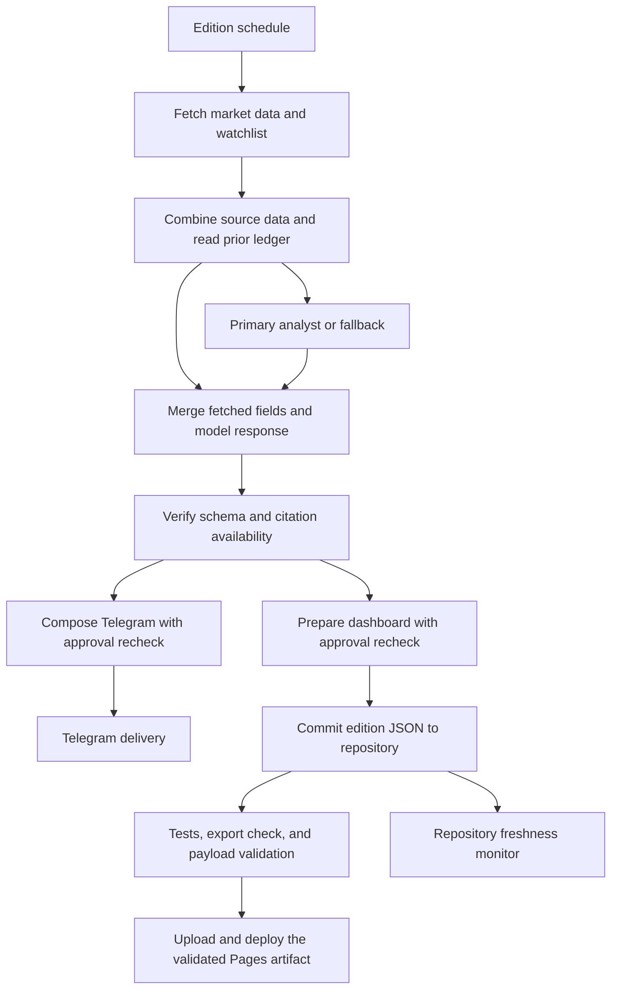

# MarketPulse architecture

This document describes the schema-v2 repository implementation. Deploying this code and importing the workflow are separate operator steps. Inspect actual deployed versions and publication timestamps; a source checkout or successful local test does not establish a live deployment.

## Workflow and source ownership

The generated export contains 46 nodes spanning US and China digests, fallback analysts, error/status notifications, and a weekly ledger summary. The workflow timezone is `Asia/Kuala_Lumpur`; US runs daily at 21:00 MYT, China runs weekdays at 16:30 MYT, and the weekly summary runs Sunday at 08:00 MYT.

The graph and node configuration live in [workflow-template.json](../scripts/workflow-template.json). [node-sources.json](../scripts/node-sources.json) maps Code nodes to editable files under [src/n8n](../src/n8n/) and declares ordered shared-source includes. [node-source.mjs](../scripts/node-source.mjs) resolves those bodies for both the builder and offline node tests. Shared runtimes hold combining, verification, and rendering behavior; shared fetching helpers handle common provider operations. Edition wrappers supply edition-specific configuration.

The builder embeds the shared policy in each verifier and output producer, appends [analysis-contract.txt](../scripts/analysis-contract.txt) to the four analyst prompts, checks node syntax without execution, and writes the export and manifest. The manifest hashes every included source file.

Edit those sources and rebuild. Editing only the generated JSON creates drift that `--check` rejects. Public exports are inactive and contain credential/destination placeholders, without runtime ledger state.

## Daily data flow



The two delivery branches have separate outcomes. A Telegram success does not establish GitHub publication or Pages deployment. Recover a failed publisher using its saved output where possible, instead of repeating an already-delivered digest.

Channel failures are not fully isolated: under the configured n8n execution order, Telegram runs first. If its retries are exhausted, the node's stop-on-error behavior can prevent the dashboard branch from running. Producer unit tests do not establish channel failure isolation.

## Verification boundary

The model response must be one JSON object with exactly:

```text
sentiment, confidence, claims, interpretation, wisdom
claims[]: claim, basedOn, direction
```

Sentiment is one of `Bullish`, `Cautiously Bullish`, `Neutral`, `Cautiously Bearish`, or `Bearish`. Confidence is `High`, `Medium`, or `Low`. Direction is `supports_bullish`, `supports_bearish`, or `neutral`.

The policy accepts one to six claims. It rejects missing fields, extra fields, malformed citations, unavailable evidence, unsupported enum values, excessive text, and numeric prose recognized by its conservative Unicode/English filter. Numeric fact strings must match the supported complete-value grammar; finding a numeric substring is insufficient. Known categorical facts such as the moving-average signal use explicit allowed values.

The verifier constructs `approvedAnalysis` and versioned `_verification` metadata. Raw response fields and legacy approval fields are not forwarded as commentary. Exceptions and validation failures produce a withheld result. Compose and Prepare independently reread and revalidate the approved object against the source fields they receive.

This is a **schema and attribution check**, not semantic fact checking. A claim can cite an available value while drawing an unsupported conclusion. Numerical wording outside the covered lexicon can escape its text filter, while benign text containing words such as “one” may be withheld. The product must disclose these limits.

Headline references retain their original `headline_N` identity when earlier items are missing. A reference must resolve to an actual bounded title. A source URL may be null; supplied links must use HTTP(S), and the dashboard labels unavailable links. Title existence does not validate the underlying story or the model's interpretation.

## Dashboard contract

Each new edition file uses `schemaVersion: 2` and is stored at `docs/data/latest-us.json` or `docs/data/latest-cn.json`.

| Field | Contract |
|---|---|
| `edition`, `generatedAt` | Expected edition and real ISO UTC generation timestamp |
| `health` | Typed source-health status, missing sources, and quality flags |
| `facts` | Usable source values keyed by stable fact identifiers |
| `dashboard`, `screener`, `economic` | Displayed values agree with their published facts |
| `news` | Explicit stable headline keys, actual titles, and nullable source links |
| `analysis` | Approved qualitative content or the exact empty withheld sentinel |
| `verification` | Version, approval status, checked claim count, and reason codes |
| `history`, `trackRecord` | Retained historical ledger information; not retroactively approved |

For approved commentary, `checkedClaims` equals the complete published claim count and rejection reasons are empty. Withheld commentary uses sentiment `Unavailable`, empty confidence/interpretation/wisdom, no claims, and at least one reason code. Withheld output does not credit a model with published analysis.

Prepare skips dashboard publication for an outage or when no usable price-and-change market row exists. A degraded run with usable market rows can publish available data, with commentary independently approved or withheld. Missing watchlist prior closes produce `N/A`, rather than a fabricated flat return; genuine unchanged prices retain a zero return.

## Historical data and publication

The original US August 9 and China August 10, 2026 snapshots predate schema v2. A frozen raw-byte hash allowlist lets those exact files remain visible as historical, unverified data while repairs are prepared. It does not assign an approval verdict to their old commentary, and any changed legacy payload loses the exception.

The Dashboard Contract and Pages workflow runs regression tests, verifies the generated workflow export, validates both dashboard files, and uploads the `docs` artifact from that same job. The deployment job depends on successful validation and uses that artifact. Repository Pages settings must use GitHub Actions; branch-based Pages publication would bypass this workflow's dependency.

A failed validation prevents a new Pages deployment. It does not undo a Git commit or a Telegram message. A successful validation also does not prove that source data is fresh or correct.

## Freshness and recovery

The monitor checks repository payloads against the publication contract and their timestamps. The latest elapsed deadlines are 14:00 UTC daily for US and 09:30 UTC on weekdays for China, including one hour of grace after the configured runs. Checks occur hourly and after edition-file pushes to `main`.

Alerts describe missing dashboard repository updates. They do not infer that the host is offline, that Telegram failed, or that the served website refreshed. Existing legacy alert titles remain recognizable.

Only a matching edition and publication date resolves an alert. The original issue body and the recovery timestamp remain recorded together. Later publications do not erase earlier missing dates; repeated checks do not duplicate an existing open or acknowledged closed alert. The monitor tracks observed expected dates, rather than reconstructing every historical gap after a monitor outage.

## Ledger limits

The verifier records approved daily observations only with a finite positive benchmark session timestamp. Unknown-session runs cannot replace the latest timestamped prior. History is bounded, with same-day replacement and market-session guards.

The existing scorer compares a prior sentiment with a later benchmark change, using market-time, date-gap, and duplicate guards. Small directional moves can be marked flat and excluded from its decided-outcome ratio. These are retrospective labels, not portfolio performance. Older records retain their original scoring semantics.

## Local verification

Run from the repository root with Node.js 22:

```sh
node scripts/build-workflow.mjs
node --test tests/*.mjs
node scripts/build-workflow.mjs --check
node .github/scripts/validate-dashboard-data.mjs --allow-historical
node .github/scripts/check-freshness.mjs
```

The tests use local fixtures and mocked dependencies. The final command is observation-only. These checks do not test provider credentials, n8n database migrations, real Telegram delivery, or production deployment. See the [workflow setup guide](../MarketPulse-Secure/workflows/README.md) for installation steps.
