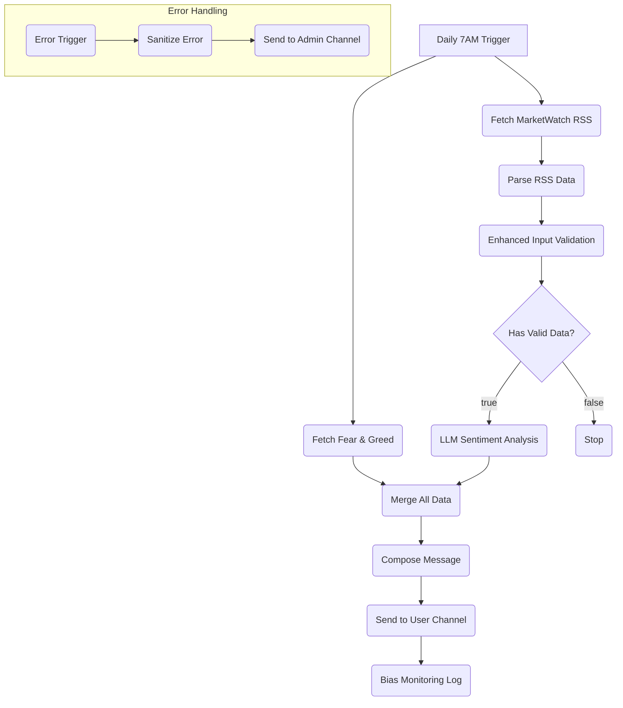

# MarketPulse Workflow v3.0 - Complete Specification

**Prepared for:** Claude Code
**Prepared by:** Manus AI (CTO)
**Date:** January 19, 2026

## 1. Project Status & Goal

We have successfully validated all necessary APIs and credentials, but have encountered persistent node connection and execution issues within the n8n UI. The goal is to **rebuild the workflow from scratch** based on a clean, robust, and validated architecture.

This document provides the complete specification for Claude Code to generate a single, working `marketpulse-workflow-v3.0.json` file.

### Validated Components ✅

| Component | Status | Details |
| :--- | :--- | :--- |
| **n8n Instance** | ✅ Online | `https://creator35lwb.app.n8n.cloud` |
| **Fear & Greed API** | ✅ Working | `https://api.alternative.me/fng/?limit=1` |
| **MarketWatch RSS** | ✅ Working | `https://www.marketwatch.com/rss/topstories` |
| **Groq API Key** | ✅ Validated | Credential: `Groq account` |
| **Telegram Bot Token** | ✅ Validated | Credential: `Telegram API` |
| **Telegram Channel ID** | ✅ Validated | `-1003257638575` |

## 2. New Workflow Architecture (v3.0)

The new architecture is designed to be simple, robust, and sequential to avoid race conditions.



## 3. Node-by-Node Specification

Claude Code: Please generate a single workflow JSON file that implements the following nodes and connections precisely.

| Node Name | Type | Configuration & Notes |
| :--- | :--- | :--- |
| **Daily 7AM Trigger** | Schedule | `0 7 * * *` |
| **Fetch Fear & Greed** | HTTP Request | **URL:** `https://api.alternative.me/fng/?limit=1` |
| **Fetch MarketWatch RSS** | HTTP Request | **URL:** `https://www.marketwatch.com/rss/topstories` |
| **Parse RSS Data** | XML | Parse the XML output from the RSS feed. |
| **Enhanced Input Validation** | Code | Filter and format the top 10 headlines. |
| **Has Valid Data?** | IF | Check if there are > 0 headlines. |
| **LLM Sentiment Analysis** | **Basic LLM Chain** | **Prompt:** (See section 4) |
| *Groq Chat Model (Sub-Node)* | Groq Chat Model | **Credential:** `Groq account`, **Model:** `llama-3.1-70b-versatile` |
| **Merge All Data** | Merge | **Mode:** Merge by Index. **Input 1:** `Fetch Fear & Greed`. **Input 2:** `LLM Sentiment Analysis`. |
| **Compose Message** | Code | Compose the final Telegram message using data from `Merge All Data`. |
| **Send to User Channel** | Telegram | **Credential:** `Telegram API`, **Chat ID:** `-1003257638575` |
| **Bias Monitoring Log** | Code | Placeholder node to log sentiment for future analysis. |
| **Error Trigger** | Error Trigger | Global error handler. |
| **Sanitize Error** | Code | Create a clean error message for Telegram. |
| **Send to Admin Channel** | Telegram | **Credential:** `Telegram API`, **Chat ID:** `-1003257638575` |

## 4. LLM Sentiment Analysis Prompt

Use this exact prompt in the **Basic LLM Chain** node:

```
Analyze the sentiment of the following financial news headlines and provide a brief market sentiment summary.

News Headlines:
{{ $json.headlines }}

Provide:
1. Overall market sentiment (Bullish/Bearish/Neutral)
2. Key themes identified
3. Brief 2-3 sentence summary
4. Confidence level (High/Medium/Low)

Keep the response concise and actionable for investors.
```

## 5. Step-by-Step Browser Configuration Guide (for User)

Once Claude Code provides the `marketpulse-workflow-v3.0.json` file:

1.  **Create a New Workflow:** In n8n, click `Add new item` > `Workflow`.
2.  **Import Workflow:** Click the three dots (`...`) > `Import from file` and select the JSON file.
3.  **Configure Credentials:** The workflow will have 2 nodes with issues. Double-click each one:
    *   **Groq Chat Model:** Select your existing `Groq account` credential.
    *   **Telegram Nodes:** Select your existing `Telegram API` credential.
4.  **Save and Publish:** Click `Save`, then `Publish`.
5.  **Test:** Click `Execute workflow` to test the full flow.

---
