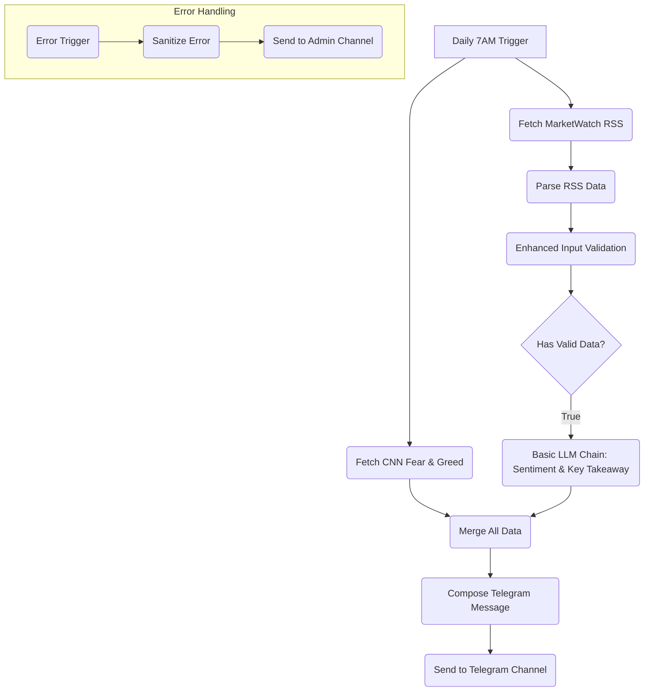

# MarketPulse v4.0 Specification

**Version:** 4.0
**Date:** January 19, 2026

## 1. Goal

To enhance the MarketPulse v3.0 workflow to create a powerful daily briefing for value investors, incorporating the **CNN Stock Market Fear & Greed Index** and a new **"Key Takeaway"** section to guide Perplexity research.

## 2. Validated Data Sources

| Data Source | API Endpoint | Status |
| :--- | :--- | :--- |
| **CNN Fear & Greed (Stock Market)** | `https://production.dataviz.cnn.io/index/fearandgreed/graphdata` | ✅ Validated |
| **MarketWatch RSS** | `http://www.marketwatch.com/rss/topstories` | ✅ Validated |
| **Groq LLM** | Groq API | ✅ Validated |
| **Telegram** | Telegram Bot API | ✅ Validated |

## 3. MarketPulse v4.0 Workflow Architecture

The architecture will be a streamlined version of v3.0, with the Fear & Greed data source swapped and a new LLM prompt for the Key Takeaway.



## 4. Key Enhancements in v4.0

### 4.1. CNN Fear & Greed Index Integration

-   The "Fetch Fear & Greed" node will be updated to call the CNN API endpoint.
-   The output will be parsed to extract the `score` and `rating`.

### 4.2. "Key Takeaway" Feature

-   The **Basic LLM Chain** node will be updated with a new prompt to generate a "Key Takeaway" section.
-   This section will identify the single most important news headline or theme for the day, providing a clear focus for Perplexity deep dives.

### 4.3. Updated LLM Prompt (for Basic LLM Chain)

```
Analyze the sentiment of the following financial news headlines and provide a brief market sentiment summary. Also, identify the single most important "Key Takeaway" for a value investor to research further.

Fear & Greed Index: {{ $json.fearGreedValue }} ({{ $json.fearGreedClassification }})

News Headlines:
{{ $json.headlines }}

Provide:
1. Overall market sentiment (Bullish/Bearish/Neutral)
2. Key themes identified
3. Brief 2-3 sentence summary
4. Confidence level (High/Medium/Low)
5. **Key Takeaway for Today:** (Identify the single most impactful headline or theme and explain why it matters for a value investor)

Keep the response concise and actionable.
```

## 5. Implementation Plan for Claude Code

1.  **Clone** the MarketPulse repository from GitHub.
2.  **Create** a new workflow file: `MarketPulse-Secure/workflows/marketpulse-workflow-v4.0.json`
3.  **Update** the "Fetch Fear & Greed" node to use the CNN API endpoint.
4.  **Update** the "Basic LLM Chain" node with the new prompt for the "Key Takeaway" feature.
5.  **Ensure** all node connections are correct as per the architecture diagram.
6.  **Commit** the new workflow with the message: "Add MarketPulse v4.0 workflow with CNN Fear & Greed and Key Takeaway feature"

This specification provides a clear roadmap for Claude Code to implement the requested enhancements, creating a more powerful and actionable MarketPulse daily briefing.
