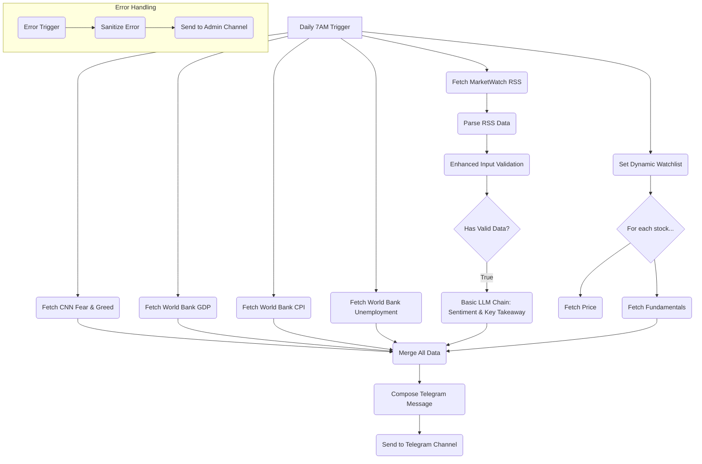

# MarketPulse v4.0 - Final Specification

**Version:** 4.0
**Date:** January 19, 2026

## 1. Goal

To create a comprehensive daily briefing for value investors by integrating all validated data sources from the Valu-Analyst framework into MarketPulse. This includes economic indicators, stock market sentiment, and a dynamic watchlist of companies.

## 2. Validated Data Sources

| Data Source | API | Status | Notes |
| :--- | :--- | :--- | :--- |
| **CNN Fear & Greed** | CNN DataViz API | ✅ Validated | `https://production.dataviz.cnn.io/index/fearandgreed/graphdata` |
| **GDP Data** | World Bank API | ✅ Validated | `https://api.worldbank.org/v2/country/USA/indicator/NY.GDP.MKTP.CD` |
| **CPI/Inflation** | World Bank API | ✅ Validated | `https://api.worldbank.org/v2/country/USA/indicator/FP.CPI.TOTL.ZG` |
| **Unemployment** | World Bank API | ✅ Validated | `https://api.worldbank.org/v2/country/USA/indicator/SL.UEM.TOTL.ZS` |
| **MarketWatch RSS** | RSS Feed | ✅ Validated | `http://www.marketwatch.com/rss/topstories` |
| **Stock Fundamentals** | Yahoo Finance | ✅ Validated | `https://query1.finance.yahoo.com/ws/insights/v2/finance/insights` |
| **Stock Prices** | Yahoo Finance | ✅ Validated | `https://query1.finance.yahoo.com/v8/finance/chart/` |

## 3. MarketPulse v4.0 Workflow Architecture



## 4. Key Enhancements in v4.0

### 4.1. Dynamic Watchlist

-   The workflow will use a **Set** node to define the watchlist companies. This makes it easy to update the list without changing the workflow logic.
-   Initial watchlist: `BABA, GOOGL, SOFI, S, ONON, ASML`

### 4.2. Economic Data with Dates and Links

-   The World Bank API nodes will be configured to extract the `date` field for each indicator.
-   The final Telegram message will include the year of the data and a link to the World Bank data page for manual verification.

### 4.3. Updated LLM Prompt (for Basic LLM Chain)

```
Analyze the sentiment of the following financial news headlines and provide a brief market sentiment summary. Also, identify the single most important "Key Takeaway" for a value investor to research further.

**Economic Indicators (USA):**
- GDP ({{ $json.gdpYear }}): {{ $json.gdpValue }}
- CPI/Inflation ({{ $json.cpiYear }}): {{ $json.cpiValue }}
- Unemployment ({{ $json.unemploymentYear }}): {{ $json.unemploymentValue }}

**Market Sentiment:**
- Fear & Greed Index: {{ $json.fearGreedValue }} ({{ $json.fearGreedClassification }})

**News Headlines:**
{{ $json.headlines }}

**Watchlist Summary:**
{{ $json.watchlistSummary }}

**Provide:**
1. Overall market sentiment (Bullish/Bearish/Neutral)
2. Key themes identified
3. Brief 2-3 sentence summary
4. Confidence level (High/Medium/Low)
5. **Key Takeaway for Today:** (Identify the single most impactful headline or theme and explain why it matters for a value investor)

Keep the response concise and actionable.
```

## 5. Implementation Plan for Claude Code

1.  **Clone** the MarketPulse repository from GitHub.
2.  **Create** a new workflow file: `MarketPulse-Secure/workflows/marketpulse-workflow-v4.0-final.json`
3.  **Implement** the multi-stage workflow as per the architecture diagram.
4.  **Add** a **Set** node for the dynamic watchlist.
5.  **Configure** the World Bank nodes to extract the `date` field.
6.  **Update** the Basic LLM Chain with the comprehensive prompt.
7.  **Commit** the new workflow with the message: "Add MarketPulse v4.0 - Final version with dynamic watchlist and dated economic data"

This specification provides a complete roadmap for Claude Code to build the final, comprehensive version of MarketPulse v4.0.
