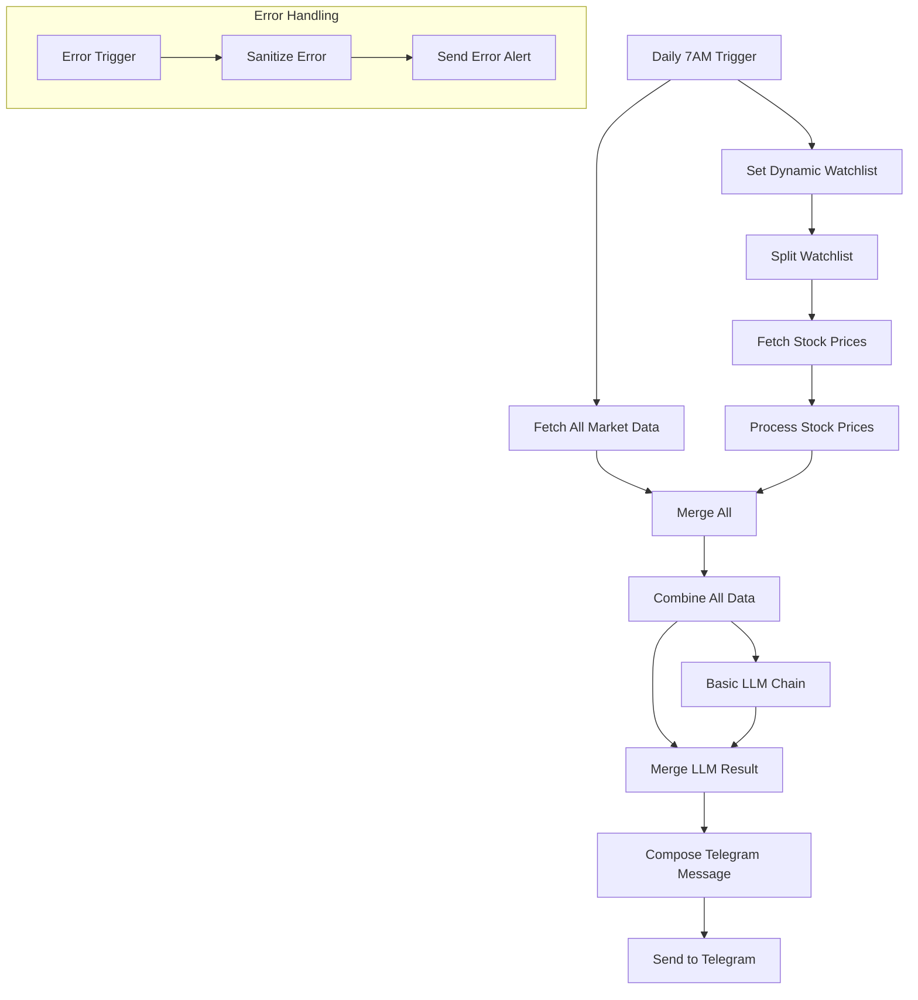

# MarketPulse v5.0 - Production Specification

**Version:** 5.0.0
**Date:** January 21, 2026
**Status:** Production Ready

## 1. Overview

MarketPulse v5.0 is a production-ready n8n workflow that delivers daily market briefings for value investors. This version introduces significant architectural improvements for reliability and real-time economic data from the Federal Reserve (FRED API).

## 2. Key Changes from v4.1

| Area | v4.1 | v5.0 |
|:-----|:-----|:-----|
| **Architecture** | 5 HTTP nodes + Merge + Process | Single Code node fetches all data sequentially |
| **Economic Data** | World Bank API (annual data) | FRED API (monthly/quarterly real-time) |
| **Indicators** | GDP, CPI, Unemployment | + Fed Funds Rate, 10Y Treasury |
| **RSS Parsing** | JSON parse (failed) | Regex extraction (works) |
| **Stock Change** | `regularMarketChangePercent` | Calculated from `chartPreviousClose` |
| **LLM Output** | Markdown formatting | Plain text (no ** symbols) |

## 3. Data Sources

| Data | API | Endpoint | Update Frequency |
|:-----|:----|:---------|:-----------------|
| **Fear & Greed** | CNN DataViz | `https://production.dataviz.cnn.io/index/fearandgreed/graphdata` | Daily |
| **GDP Growth** | FRED | `A191RL1Q225SBEA` (Real GDP % Change) | Quarterly |
| **Inflation/CPI** | FRED | `CPIAUCSL` (Consumer Price Index) | Monthly |
| **Unemployment** | FRED | `UNRATE` (Unemployment Rate) | Monthly |
| **Fed Funds Rate** | FRED | `DFEDTARU` (Target Rate Upper) | Daily (business days) |
| **10Y Treasury** | FRED | `DGS10` (10-Year Yield) | Daily (business days) |
| **Headlines** | MarketWatch | RSS feed `/rss/topstories` | Real-time |
| **Stock Prices** | Yahoo Finance | Chart API `/v8/finance/chart/` | Real-time |

## 4. Workflow Architecture



## 5. Node Specifications

### 5.1 Fetch All Market Data (Code Node)

Single JavaScript code node that fetches ALL market data sequentially:

1. CNN Fear & Greed Index
2. FRED Unemployment Rate
3. FRED CPI (calculates YoY from last 13 months)
4. FRED GDP Growth (quarterly)
5. FRED Fed Funds Rate (loops to skip weekends)
6. FRED 10Y Treasury Yield (loops to skip weekends)
7. MarketWatch RSS Headlines (regex parsing)

**Key Features:**
- Sequential execution ensures all data is available
- Error handling with try/catch for each API
- FRED data loops through last 10 observations to find valid value (skips weekend "." values)
- RSS XML parsed with regex instead of JSON

### 5.2 Process Stock Prices

Calculates percentage change from previous close:

```javascript
const changeAmt = price - prevClose;
const changePct = (changeAmt / prevClose) * 100;
```

Uses `chartPreviousClose` from Yahoo Finance API instead of `regularMarketChangePercent` (which can be null).

### 5.3 Basic LLM Chain

**Model:** Google Gemini 1.5 Flash

**Prompt Structure:**
- Receives all economic data, Fear & Greed, headlines, watchlist
- Outputs: Market Sentiment, Key Themes, Summary, Key Takeaway, Watchlist Notes
- **Explicit instruction:** No Markdown formatting (plain text only)

### 5.4 Compose Telegram Message

**Format:** Plain text with emoji indicators

**Fear & Greed Emoji Scale:**
- 🔴 = Extreme Fear (0-24)
- 🟠 = Fear (25-44)
- 🟡 = Neutral (45-54)
- 🟢 = Greed (55-74)
- 🟢🟢 = Extreme Greed (75-100)

## 6. Configuration

### 6.1 Required API Keys

| Service | Where to Get | Config Location |
|:--------|:-------------|:----------------|
| **FRED** | https://fred.stlouisfed.org/docs/api/api_key.html | In Code node (line 8) |
| **Google Gemini** | https://ai.google.dev/ | n8n Credentials |
| **Telegram Bot** | @BotFather | n8n Credentials |

### 6.2 Watchlist Configuration

Edit the "Set Dynamic Watchlist" node:

```json
{
  "watchlist": "GOOGL,BABA,ADBE,SOFI,ASML"
}
```

### 6.3 Telegram Channel

Default channel ID: `-1003257638575`

Update in both:
- "Send to Telegram" node
- "Send Error Alert" node

## 7. Output Format

```
📊 MarketPulse Daily Digest
━━━━━━━━━━━━━━━━━━━━
📅 Tuesday, January 21, 2026

🎯 FEAR & GREED INDEX 🟡
Score: 48/100 | Neutral
Change: -14 (1d) | -11 (1w)

📈 ECONOMIC INDICATORS (USA)
• GDP Growth (Jul 2025): +4.3% (QoQ)
• Inflation/CPI (Dec 2025): 2.65%
• Unemployment (Dec 2025): 4.1%
• Fed Funds Rate: 4.50%
• 10Y Treasury: 4.62%

📊 WATCHLIST
• GOOGL: $195.27 (+0.85%)
• BABA: $85.12 (-1.23%)
• ADBE: $452.30 (+0.42%)
• SOFI: $14.56 (-2.15%)
• ASML: $698.45 (+1.78%)

💡 AI ANALYSIS
[LLM-generated analysis in plain text format]

━━━━━━━━━━━━━━━━━━━━
⚠️ Disclaimer: AI-generated analysis for informational purposes only. Not financial advice.

📎 Sources: CNN Fear & Greed, FRED (Federal Reserve), MarketWatch, Yahoo Finance

MarketPulse v5.0 | Manus AI & Claude Code
```

## 8. Error Handling

- All HTTP requests have `continueOnFail: true`
- Individual API failures don't crash the workflow
- Failed data shows as "N/A" in final message
- Error trigger sends alert to admin Telegram channel
- 30-second timeout on all API calls

## 9. Deployment Instructions

1. Import `marketpulse-workflow-v5.0.json` into n8n
2. Configure credentials:
   - Add FRED API key to Code node (line 8)
   - Set up Google Gemini credential
   - Set up Telegram Bot credential
3. Update Telegram channel ID if needed
4. Test with manual execution
5. Activate for daily 7AM schedule

## 10. Migration Notes

### From v4.1 to v5.0

1. **FRED API Key Required:** Create free account at FRED and add key to Code node
2. **Economic Data More Current:** Now shows monthly/quarterly vs annual
3. **New Indicators:** Fed Funds Rate and Treasury yield now included
4. **Simpler Architecture:** Single data fetch node is more reliable

### Known Issues Resolved

| Issue | Root Cause | Fix |
|:------|:-----------|:----|
| All data N/A | Parallel node execution race condition | Sequential fetch in single Code node |
| RSS headlines empty | XML parsed as JSON | Regex extraction |
| Stock % change N/A | `regularMarketChangePercent` null | Calculate from `chartPreviousClose` |
| ** symbols in output | LLM Markdown formatting | Explicit plain text instruction in prompt |
| Fed Rate N/A | FRED returns "." on weekends | Loop through last 10 values |

## 11. File Locations

```
MarketPulse-Secure/
├── workflows/
│   ├── marketpulse-workflow-v5.0.json    # Current production
│   ├── marketpulse-workflow-v4.1-fixed.json
│   └── [older versions...]
├── docs/
│   └── WORKFLOW_V5_SPECIFICATION.md      # This file
└── README.md
```

## 12. Authors

- **Manus AI** - Primary AI Agent
- **Claude Code** - Development & Debugging

---

*MarketPulse v5.0 - Built for Value Investors*
